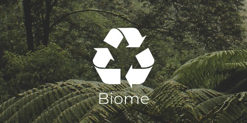

<h1 align="center">
    
    <p>Biome - Renove a esperança ♻ </p>
</h1>


## [Visite o site](https://guisilvas.github.io/projeto-integrador-AWS-META/index.html)

<br>

## 📄 Sobre

**Biome** é um site que utiliza HTML, CSS e JavaScript, o projeto foi realizado em grupo durante o primeiro bootcamp da Proz em parceria com a AWS e Meta com o intuito de introduzir a base da programação.

<br>

## 🔨 Ferramentas

- [HTML](https://www.w3.org/TR/html/)
- [CSS](https://www.w3.org/TR/html/)
- [JavaScript](https://developer.mozilla.org/docs/Web/JavaScript/Guide)

<br>

## 🎯 Objetivo

Este é o projeto final ministrado pela professora [Juliana Sinnot](https://github.com/julianasinnott) realizado pelo Grupo 03 da Turma 2 do primeiro bootcamp da [Proz Educação](https://prozeducacao.com.br/) oferecido pelas empresas [Meta](https://about.meta.com/) e [AWS](https://aws.amazon.com/). O principal objetivo do projeto é aplicar as habilidades em frontend adquiridas ao longo do curso, desenvolver um website com um tema importante e relevante. A Biome aborda a sustentabilidade, procura reeducar a forma que milhões de brasileiros veêm o meio-ambiente e mostrar como podemos ser mais generosos com nosso planeta. Fazer o certo não deveria ser algo inusitado em nossa realidade.

<br>

## ⚡ Contribua

```bash
    # Clone o repositório
    git clone https://github.com/guisilvas/projeto-integrador-AWS-META.git
```

<br>

---
<br>

<p align="center">por Guilherme Soares Silva</p>